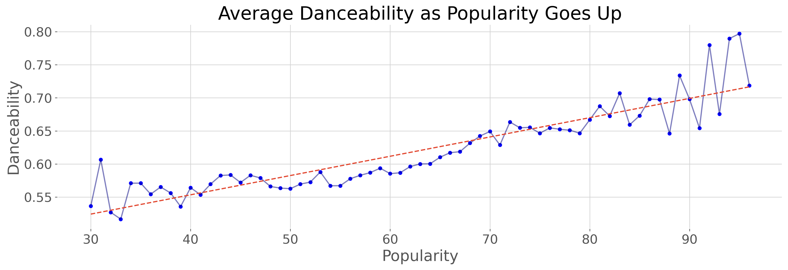
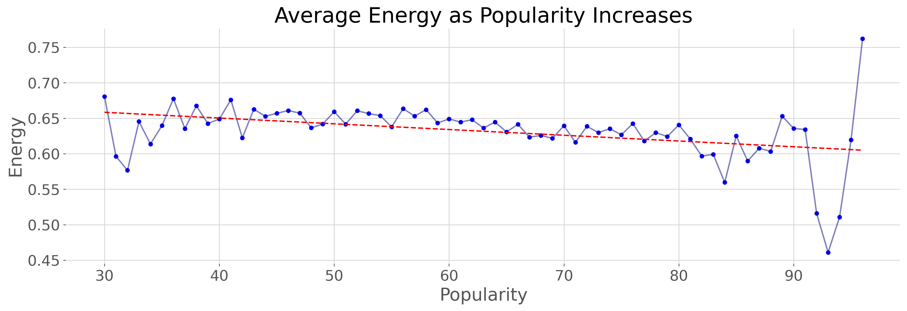
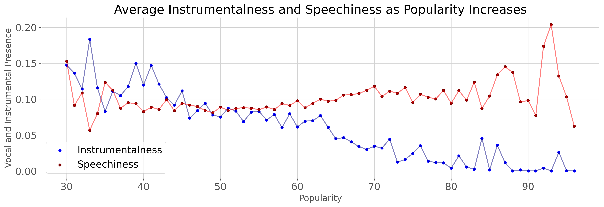
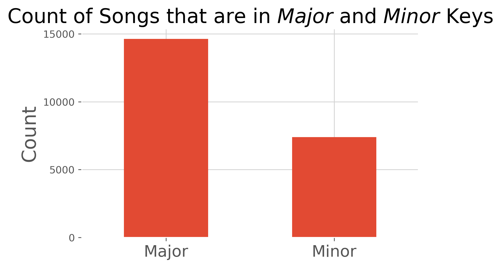
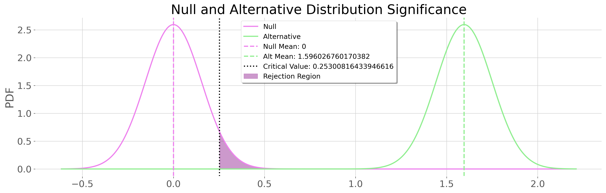
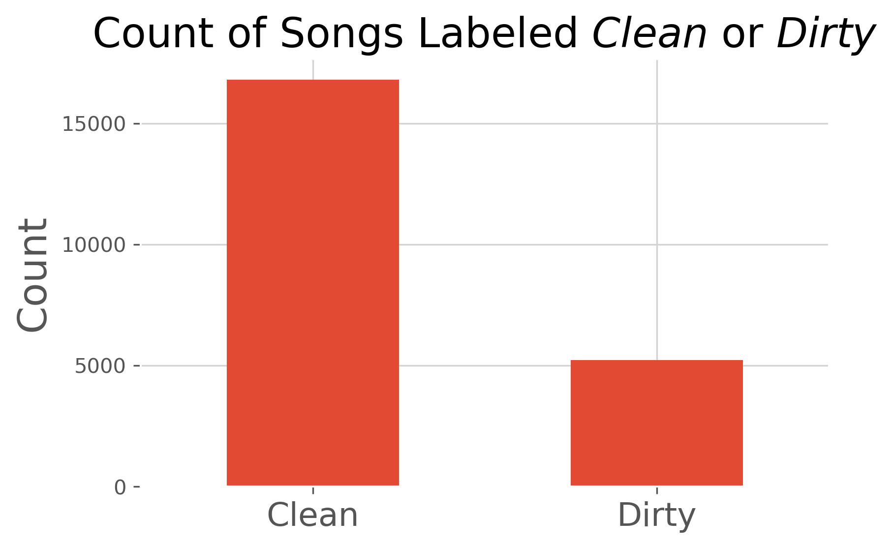
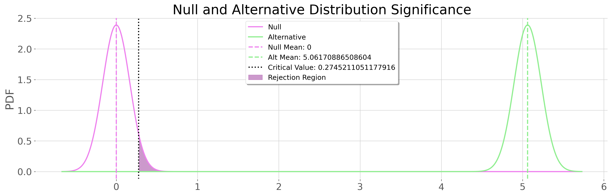

# Probabilistic Popularity

# Do Features of Songs on Spotify Correlate to Songs' Popularity?
[Introduction](#Introduction)

[Technologies Used](#Technologies-Used)

[What's in the Data?](#What's-in-the-Data?)

[Exploratory Data Analysis](#Exploratory-Data-Analysis)

[Hypothesis Testing](#Hypothesis-Testing-on-Binary-Data)

[Conclusion](#Conclusion)

# **Introduction**
There's a time when we listen to a song, and we're immediately hooked! What truly attracts us to certain songs, and what makes a song get the whole world loving it like they've never loved before? We'll take a deep dive into a vast collection of songs on Spotify, look at the songs' attributes, and find correlation of those attributes to the songs' popularity.

## **Technologies Used**
* *Pandas*
* *NumPy*
* *Scipy*
* *Matplotlib*

## **What's in the Data?**
This dataset contains a collection of 174,389 songs from the Spotify API provided by a [Kaggle](https://www.kaggle.com/yamaerenay/spotify-dataset-19212020-160k-tracks) user, with publishing spanning from 1920 to 2021. We'll focus on a subset of the data that spans from 2000 to 2021, narrowing it down to 40,531 songs, and keeping our spotlight on modernity. Each row represents a song and its features. We'll define the features of focus, and what each of them means and represents further down. All of this data is in a CSV file.

# **Exploratory Data Analysis**
I created a subset of the data to keep it relevant to current trends from the year 2000 to 2021. I cleaned it up to only analyze my columns of interest, which are:

 

[Popularity](#Popularity)

[Danceability](#Danceability)

[Energy](#Energy)

[Instrumentalness](#Instrumentalness)

[Speechiness](#Speechiness)

[Explicit](#Explicit)

[Mode](#Mode)

 

### Features of Focus as Popularity Goes Up
|**POPULARITY** |artists|name|Danceability |Energy |Instrumentalness |Speechiness |Explicit |Mode |
|:--------------|:-------|:----|:------------:|:------:|:----------------:|:-----------:|:--------:|:----:|
|         **30**| ['Robin Trower']|Farther on up the Road - 2012 Remaster| 0.469|  0.918|         0.000392|      0.1730|        0|    1|
|         **30**| ['Armin van Buuren']|A State Of Trance (ASOT 996) - Tune Of The Yea...| 0.397|  0.638|         0.000000|      0.1760|        0|    1|
|         **30**| ['Above & Beyond', 'Zoë Johnston']|Reverie - Above & Beyond Club Mix| 0.453|  0.756|         0.064800|      0.0472|        0|    1|
|...            |...    |    |...      |...    |...              |...         |...      |...  |
|         **95**| ['KAROL G']|BICHOTA	| 0.863|  0.666|         0.000493|      0.1520|        1|    0|
|         **96**| ['Ariana Grande']|positions	| 0.737|  0.802|         0.000000|      0.0878|        1|    1|
|         **96**| ['24kGoldn', 'iann dior'] |Mood (feat. iann dior)| 0.700|  0.722|         0.000000|      0.0369|        1|    0|

Above, you'll se we sorted by *Popularity* in ascending order from **30** to **100**, dropping it down to **22,030 rows x 9 columns**.

 

## **Descriptive & Inferential Statistics**
For every column of focus which contain float values, we'll visualize the mean of select elements in relation to ascending popularity.

#### **Popularity**
> **Spotify Popularity** is an extremely important value that Spotify uses internally to rank all tracks on **a scale from 0 to 100**.
 
It lets you see how the Spotify algorithm currently evaluates you and your music. The higher your popularity index, the more likely the algorithm is to recommend you to new listeners, and place you in algorithmic playlists like *Release Radar* and *Discover Weekly*.

 

### **QUESTION:**
#### **Are there features with significant correlation to popularity, and are we able to move forward with further linear regression to study the relationships even further?** 

While we may theorize that there will be correlation, we'll take a skeptical approach and test for a correlation of means, with binary data going through an extra test for a difference in means.

 
 

## Primary Hypothesis
#### Null Hypothesis
> There is **no correlation** among features, and there will be **no need for further study**.

#### Alternative Hypothesis
> There is **definite correlation**, and we **can further study** the relationship among those values.

#### Significance Level 
##### alpha = 0.05
> If my p-values are above my **significance level**(alpha), I will fail to reject my **Null Hypothesis**.

 
 

## Average Danceability as Popularity Increases

#### **Danceability**
> Describes how suitable a track is for dancing based on a combination of musical elements including **tempo, rhythm stability, beat strength, and overall regularity.**
 
A value of 0.0 is least danceable and 1.0 is most danceable.

 

I calculated the average danceability for each popularity rating from 30 - 100.

|popularity|danceability|
|----------|------------|
**30**|0.536581
**31**|0.606585
**32**|0.527000
...|...
**94**|0.789600
**95**|0.797000
**96**|0.718500

 

 r = 0.904 
 p-value = 1.3066903836183793e-25
 
 The [Pearson correlation](https://www.medcalc.org/manual/correlation.php#:~:text=Pearson's%20correlation%20coefficient%20r%20with,there%20is%20a%20positive%20correlation.) **r** coefficient is a number between -1 and 1, expessing the degree that on an average, two variables change correspondingly.
 
We have a 90.4% positive correlation between the two variables, and with a tiny **p-value** we can reject our Primary Null Hypothesis.
 
 

## Average Energy as Popularity Increases

#### **Energy**
> Energy is a measure from 0.0 to 1.0 and represents a perceptual measure of intensity and activity. Typically, energetic tracks feel fast, loud, and noisy.

 

I calculated the average energy for each popularity rating from 30 - 100.

|popularity|energy|
|----------|------|
**30**|0.680514
**31**|0.596317
**32**|0.576679
...|...
**94**|0.510800
**95**|0.619500
**96**|0.762000

 

 r = -0.387 
 p-value = 0.0012336107098958485
 
Surprisingly, we have a 38.7% negative correlation between the two variables, and with a tiny **p-value** we can reject our Primary Null Hypothesis again. It isn't much of a correlation but it's enough to still reject.

## Average Instrumentalness and Speechiness as Popularity Increases

#### **Instrumentalness**
> Predicts whether a track contains no vocals. 
 
The closer the instrumentalness value is to 1.0, the greater likelihood the track contains no vocal content.

 

#### **Speechiness**
> Speechiness detects the presence of spoken words in a track. 
 
The more exclusively speech-like the recording (e.g. talk show, audio book, poetry), the closer to 1.0 the attribute value.

 

I calculated the average instrumentalness and speechiness for each popularity rating from 30 - 100.

|popularity|instrumentalness|speechiness|
|----------|----------------|-----------|
**30**|1.472500e-01|0.152673|
**31**|1.362448e-01|0.091273|
**32**|1.141435e-01|0.108663|
...|...|...|
**94**|2.600000e-02|0.132320|
**95**|2.726000e-04|0.103200|
**96**|0.000000e+00|0.062350|

 

## Instrumentalness Pearson Correlation
 r = -0.935 
 p-value = 5.579106125150611e-31
 
## Speechiness Pearson Correlation
 r = 0.386 
 p-value = 0.0012549387454434571
 
 We can already see some major 3-way correlation here. Speech is at 38.6% positive correlation as popularity rises, and a massive 93.5% negative correlation as popularity rises! With both of our **p-values** way below our **significance level**, we can once again reject our Primary Null Hypothesis.
 
# Hypothesis Testing on Binary Data
Our binary data is especially of interest. This data has the possibility of really exposing darker elements of the consumers' psyche.

### **Mode**
> This is the measurement of whether a song is in a **Major(1) or a Minor(0) scale**.
 
Major is a scale in which the third scale degree (the mediant) is a major third above the tonic note. 
 
For Minor, the third degree is a minor third above the tonic.

In lamens terms, **Major** is uplifting and pleasant, and **Minor** is more serious, and gloomy.

 
 

## **Secondary Hypothesis**
#### Null Hypothesis
> As popularity goes up, songs **become more major**.

#### Alternative Hypothesis
> As popularity goes up, songs **become more minor**..

#### Significance Level 
##### alpha = 0.05
> If my p-value is above my **significance level**(alpha), I will fail to reject my **Null Hypothesis**.

 
 

I gathered a count of the songs on major, and minor scales out of the whole 22,030 subset.

 

The majority of songs in the subset are on a major scale, but what about as we ascend in popularity? I gathered the average popularity of major and minor songs.

### Minor Popularity Avg: **59.35**
### Major Popularity Avg: **57.75**

 

This shows us that there's a trend of songs becoming more minor as popularity ascends.
If we run a [Student's T-Test](https://www.statisticshowto.com/probability-and-statistics/t-test/#:~:text=The%20t%20test%20tells%20you,could%20have%20happened%20by%20chance.&text=A%20t%20test%20can%20tell,those%20results%20happening%20by%20chance.), we discover that the groups are **10 times as different from each other**:

### t = 10.38
### p = 3.93234546e-25

With there being a significance in differences, and a small **p-value**, we can reject our Secondary Null Hypothesis.

Now let's jump back to our Primary Hypothesis. Going off of our T-Test, with rejecting that songs are more major as popularity goes up, there is a good chance that we will reject our Primary Null Hypothesis of the feature, **mode**, not correlating with popularity.

Let's take a look!

 

<a href="https://www.codecogs.com/eqnedit.php?latex=\dpi{150}&space;\\&space;\alpha&space;=&space;0.05&space;\\&space;\text{power}&space;=&space;0.9996&space;\\&space;\text{difference}&space;=&space;1758.37&space;\\&space;\text{hedges-g&space;effect}&space;=&space;0.2916&space;\\&space;\\&space;H_{null}:&space;\left&space;(\mu_{true}-\mu_{false}&space;\right&space;)&space;\leq&space;0&space;\\&space;H_{alt}:&space;\&space;\left&space;(\mu_{true}-\mu_{false}&space;\right&space;)&space;>&space;0&space;\\&space;\\&space;\text&space;{\textsl{p-value}}&space;=&space;0.00000025" target="_blank">&space;0&space;\\&space;\\&space;\text&space;{\textsl{p-value}}&space;=&space;3.93234546e-25" title="\\ H_{null}: \left (\mu_{true}-\mu_{false} \right ) \leq 0 \\ H_{alt}: \ \left (\mu_{true}-\mu_{false} \right ) > " /></a>

We can officially reject the Primary Null Hypothesis once again.

 

### **Explicit**
> This is the measurement of whether a song is in **Clean(0) or a Dirty(1)**.

 

## **Secondary Hypothesis**
#### Null Hypothesis
> As popularity goes up, songs **become more clean**.

#### Alternative Hypothesis
> As popularity goes up, songs **become more dirty**..

#### Significance Level 
##### alpha = 0.05
> If my p-value is above my **significance level**(alpha), I will fail to reject my **Null Hypothesis**.

 
 

I gathered a count of clean and dirty songs out of the whole 22,030 subset.

 

The majority of songs in the subset are clean, but what about as we ascend in popularity? I gathered the average popularity of clean and dirty songs.

### Clean Popularity Avg: **57.08**
### Dirty Popularity Avg: **61.15**

 

This shows us that there's a trend of songs becoming more dirty as popularity ascends.
We run another [Student's T-Test](https://www.statisticshowto.com/probability-and-statistics/t-test/#:~:text=The%20t%20test%20tells%20you,could%20have%20happened%20by%20chance.&text=A%20t%20test%20can%20tell,those%20results%20happening%20by%20chance.) and we find a monstrous  **30x difference**:

### t = 30.33
### p = 4.93236088e-192

With a massive significant difference and a **p-value** so close to zero, we are absolutely rejecting our Secondary Null Hypothesis

Now our Primary Hypothesis. Going off of our T-Test, with rejecting that songs are more clean as popularity goes up, we can be pretty sure that we will reject our Primary Null Hypothesis of the feature, **explicit**, not correlating with popularity.

Let's look at our final test shall we?

 

<a href="https://www.codecogs.com/eqnedit.php?latex=\dpi{150}&space;\\&space;\alpha&space;=&space;0.05&space;\\&space;\text{power}&space;=&space;0.9996&space;\\&space;\text{difference}&space;=&space;1758.37&space;\\&space;\text{hedges-g&space;effect}&space;=&space;0.2916&space;\\&space;\\&space;H_{null}:&space;\left&space;(\mu_{true}-\mu_{false}&space;\right&space;)&space;\leq&space;0&space;\\&space;H_{alt}:&space;\&space;\left&space;(\mu_{true}-\mu_{false}&space;\right&space;)&space;>&space;0&space;\\&space;\\&space;\text&space;{\textsl{p-value}}&space;=&space;0.00000025" target="_blank">&space;0&space;\\&space;\\&space;\text&space;{\textsl{p-value}}&space;=&space;4.93236088e-192" title="\\ H_{null}: \left (\mu_{true}-\mu_{false} \right ) \leq 0 \\ H_{alt}: \ \left (\mu_{true}-\mu_{false} \right ) > " /></a>

We can officially reject the Primary Null Hypothesis.

# Conclusion
We can clearly state that we were beyond wrong. All of our features of focus show high possibilities of correlating with popularity. This is beautiful, because it means we have further progress in our research to do.

With enough data from this study, we can get down to the micro details, which will unlock the key for us to create a probabilistic feature template to act as a foundation for creating hit songs. 
